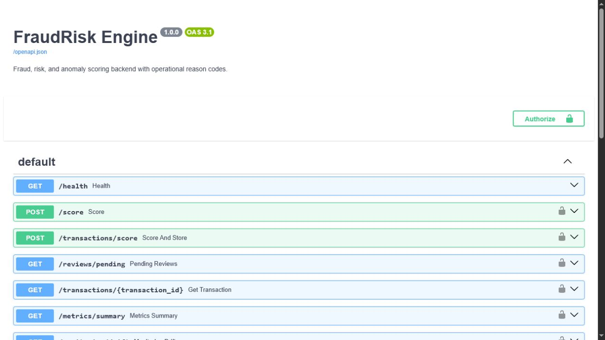
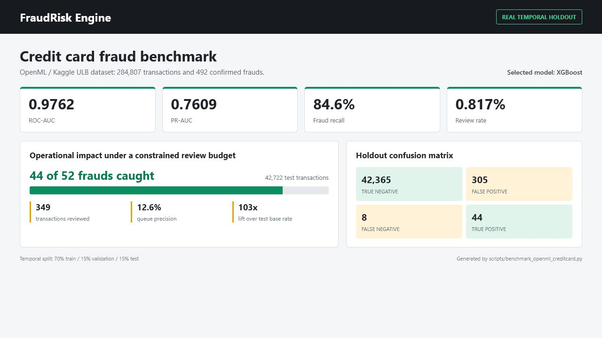
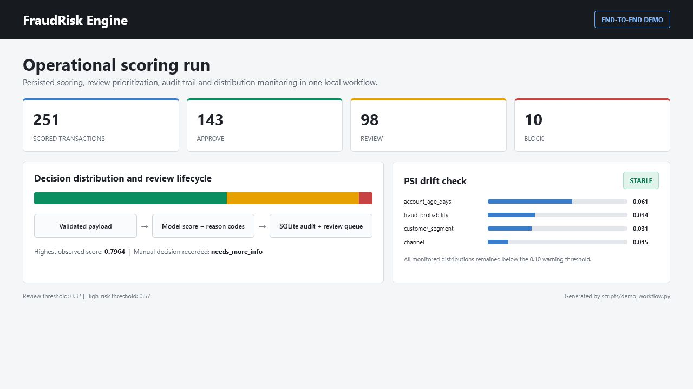

# FraudRisk Engine

[](https://github.com/Umbura/fraud-risk-engine-portfolio/actions/workflows/ci.yml)
[](https://github.com/Umbura/fraud-risk-engine-portfolio/releases/tag/v1.0.0)


[](LICENSE)

Fraud-risk scoring backend for operational review prioritization, transaction audit, and data-drift monitoring.

The service turns validated transaction features into a fraud probability, an operational decision, and human-readable reason codes. It combines a reproducible local workflow with evaluation on a real, heavily imbalanced public fraud dataset.

<p align="center">
  
</p>

## Key Capabilities

- **Risk scoring API:** FastAPI contracts for stateless and persisted transaction scoring.
- **Operational decisions:** Validation-selected thresholds map scores to `approve`, `review`, or `block`.
- **Human review workflow:** Prioritized queue, audit lookup, reviewer decision, and operational metrics.
- **Explainability:** Readable reason codes for business features and an optional global SHAP report.
- **Monitoring and access control:** PSI drift checks plus optional `X-API-Key` protection.
- **Reproducible evaluation:** Synthetic API data, temporal real-data benchmark, Docker, tests, and CI.

The default workflow requires no paid API, private dataset, or Kaggle credentials.

## Proven Results

### Real Fraud Benchmark

<p align="center">
  
</p>

On the temporal holdout from the OpenML/Kaggle ULB dataset, XGBoost caught `44` of `52` fraud cases while sending only `0.817%` of transactions to review. The resulting queue was approximately `103x` richer in fraud than the test base rate.

Detailed methodology and limitations are documented in [the benchmark report](docs/openml_creditcard_results_2026-07-02.md).

### End-to-End Operational Run

<p align="center">
  
</p>

The reproducible demo scored and persisted `251` transactions, populated the review queue, recorded a manual decision, returned audit metrics, and completed the PSI check with a global `stable` status.

## Quick Start

```bash
uv sync --extra dev --extra api
uv run python scripts/create_dataset.py
uv run python scripts/train_model.py
uv run uvicorn fraudrisk_engine.api:app --reload
```

Open the interactive API at `http://127.0.0.1:8000/docs`.

Run the complete scoring, persistence, review, metrics, and drift demonstration:

```bash
uv run python scripts/demo_workflow.py
```

## Decision Model

The project separates data generation, model training, threshold selection, benchmark evaluation, API scoring, review persistence, and monitoring. Fraud probabilities are mapped to:

- `approve` below the review threshold;
- `review` at or above the review threshold;
- `block` at or above the high-risk threshold.

The synthetic dataset supports readable local behavior and reason codes. The OpenML benchmark independently tests the modeling approach on real fraud labels.

## Safety Model

The backend does not execute financial actions. It returns a risk score, a decision label, and supporting reason codes. Any production use would require downstream review, monitoring, access control, logging, and policy enforcement.

Controls included in this repository:

- target column excluded from features;
- validation-based threshold selection;
- temporal holdout evaluation for the real benchmark;
- explicit fraud-base-rate reporting;
- generated artifacts excluded from Git;
- no secrets required for the default workflow;
- SQLite audit trail for scored transactions and review outcomes;
- optional API-key protection using constant-time comparison;
- minimum sample requirement before assigning an overall drift status;
- feature and score distribution monitoring against the validation reference profile.

The OpenML benchmark uses anonymized PCA features (`V1` to `V28`). It is suitable for fraud-detection metrics, but not for business-readable explanations.

## API

The interactive OpenAPI contract documents every request and response schema.

Endpoints:

- `GET /health`
- `POST /score`
- `POST /transactions/score`
- `GET /transactions/{transaction_id}`
- `GET /reviews/pending`
- `POST /reviews/{transaction_id}/decision`
- `GET /metrics/summary`
- `GET /monitoring/drift`

`POST /score` returns a stateless score. `POST /transactions/score` calculates the same score and stores the transaction, score, decision, model version, reason codes, and review status in SQLite.

`GET /transactions/{transaction_id}` returns the audit record for a scored transaction. `GET /metrics/summary` returns operational totals for scored transactions, pending reviews, completed reviews, and manual review outcomes. `GET /monitoring/drift` compares recent persisted transactions with the validation reference profile and reports PSI by feature. The default minimum is 200 recent records; below that volume, the overall status is `insufficient_data`.

Authentication is disabled for the default local workflow. Set `FRAUDRISK_API_KEY` to protect every endpoint except `/health` and include the value in the `X-API-Key` header. Swagger exposes an `Authorize` control when the API is open in `/docs`.

```powershell
$env:FRAUDRISK_API_KEY = "local-demo-key"
uv run uvicorn fraudrisk_engine.api:app --reload
```

Example stateless request:

```bash
curl -X POST http://127.0.0.1:8000/score \
  -H "Content-Type: application/json" \
  -H "X-API-Key: local-demo-key" \
  -d "{
    \"amount\": 850.0,
    \"account_age_days\": 12,
    \"customer_tx_count_24h\": 7,
    \"merchant_risk_score\": 0.91,
    \"device_trust_score\": 0.18,
    \"velocity_1h\": 6,
    \"distance_from_home_km\": 980.0,
    \"hour\": 2,
    \"payment_attempts\": 4,
    \"prior_chargebacks\": 1,
    \"is_foreign_card\": 1,
    \"is_high_risk_mcc\": 1,
    \"is_weekend\": 1,
    \"is_new_device\": 1,
    \"customer_segment\": \"new\",
    \"channel\": \"ecommerce\"
  }"
```

Example response:

```json
{
  "fraud_probability": 0.7863,
  "decision": "block",
  "review_threshold": 0.32,
  "high_risk_threshold": 0.57,
  "reason_codes": [
    {
      "feature": "amount",
      "value": 850.0,
      "benchmark": "p90=200.99",
      "severity": "high",
      "message": "Transaction amount is unusually high for the training population."
    }
  ],
  "model_name": "random_forest"
}
```

Example review decision:

```bash
curl -X POST http://127.0.0.1:8000/reviews/txn_001/decision \
  -H "Content-Type: application/json" \
  -H "X-API-Key: local-demo-key" \
  -d "{
    \"review_decision\": \"fraud\",
    \"reviewer\": \"analyst\",
    \"notes\": \"Confirmed during manual review.\"
  }"
```

## Local Commands

Install dependencies:

```bash
uv sync --extra dev --extra api
```

Run tests and lint:

```bash
uv run pytest
uv run ruff check .
```

Train the local synthetic model:

```bash
uv run python scripts/create_dataset.py
uv run python scripts/train_model.py
uv run python scripts/run_eval.py
```

Train with XGBoost:

```bash
uv sync --extra dev --extra api --extra boosting
uv run python scripts/train_model.py --include-xgboost
```

Run the real OpenML benchmark:

```bash
uv run python scripts/fetch_openml_creditcard.py
uv run python scripts/benchmark_openml_creditcard.py --include-xgboost
```

Score a CSV batch:

```bash
uv run python scripts/score_batch.py \
  --input data/transactions.csv \
  --output reports/batch_scores.csv \
  --summary reports/batch_summary.json
```

Generate a SHAP report:

```bash
uv sync --extra explain
uv run python scripts/write_shap_report.py --max-rows 100
```

Run the complete scoring, persistence, review, metrics, and drift workflow:

```bash
uv run python scripts/demo_workflow.py
```

The result is printed to the terminal and written to `reports/demo_workflow.json`.

## Docker

Build and run the API container:

```bash
docker build -t fraudrisk-engine .
docker run --rm -p 8000:8000 -e FRAUDRISK_API_KEY=local-demo-key fraudrisk-engine
```

The container creates the synthetic dataset and trains the local model before starting the API. Generated artifacts remain outside Git.

## Validation Results

Latest local validation:

| Check | Result |
| --- | ---: |
| Pytest | 11 passed, 1 skipped in minimal environment |
| Ruff | passed |
| Real OpenML benchmark | completed |
| Generated data committed | no |
| Generated reports committed | no |

The OpenML CSV is stored locally at `data/openml_creditcard.csv` and ignored by Git. SQLite databases, model artifacts, and generated reports are also ignored by Git.

## Repository Layout

```text
docs/                  model notes, benchmark results, and scope notes
scripts/               dataset, training, benchmark, and report commands
src/fraudrisk_engine/  package source
tests/                 unit and integration tests
data/                  generated local datasets, ignored by Git
models/                generated model artifacts, ignored by Git
reports/               generated local reports, ignored by Git
```

## Project Status

Version `1.0.0` completes the intended portfolio scope. Generated datasets, model artifacts, reports, and SQLite files remain outside Git. The repository includes the model card, reproducible commands, CI, an end-to-end demo, a real benchmark, operational review endpoints, access control, and drift checks.

## Roadmap

### Phase 1: Backend MVP

Status: implemented.

- Synthetic data generator.
- Baseline model training.
- FastAPI scoring endpoint.
- SQLite persistence.
- Manual review workflow.
- Batch scoring.
- Local tests and CI.

### Phase 2: Real Fraud Benchmark

Status: implemented.

- OpenML/Kaggle ULB dataset ingestion.
- Temporal split benchmark.
- Fixed-review-budget metrics.
- Benchmark documentation.

### Phase 3: Explainability And Portfolio Polish

Status: implemented for portfolio scope.

- SHAP global summary.
- Model card.
- README publication pass.
- Case study.

### Phase 4: Portfolio Hardening

Status: implemented for portfolio scope.

- Optional API-key authentication.
- PSI drift monitoring for stored transactions.
- Health endpoint and Docker health check.
- Model-versioned SQLite audit trail.
- End-to-end workflow demonstration.

Large-scale production deployment remains outside the project scope. It would require centralized identity and RBAC, managed PostgreSQL, infrastructure telemetry, a model registry, privacy controls, incident response, and governed retraining.

## References

- OpenML credit-card fraud dataset: https://www.openml.org/d/42175
- Kaggle ULB credit-card fraud dataset: https://www.kaggle.com/datasets/mlg-ulb/creditcardfraud
- Fraud Detection Handbook: https://github.com/Fraud-Detection-Handbook/fraud-detection-handbook
- PyOD: https://github.com/yzhao062/pyod
- Amazon Fraud Dataset Benchmark: https://github.com/amazon-science/fraud-dataset-benchmark
- scikit-learn documentation: https://scikit-learn.org/

License and reuse notes are documented in `docs/reuse_and_license.md`.
